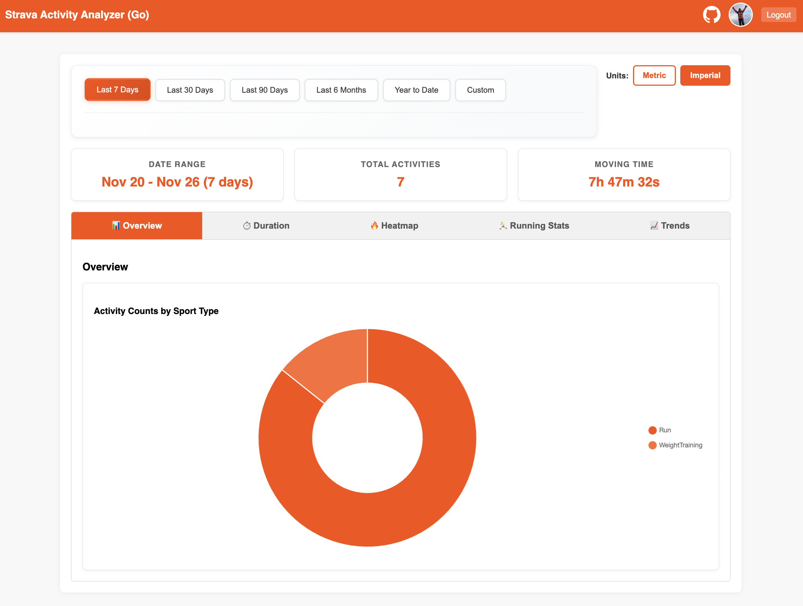
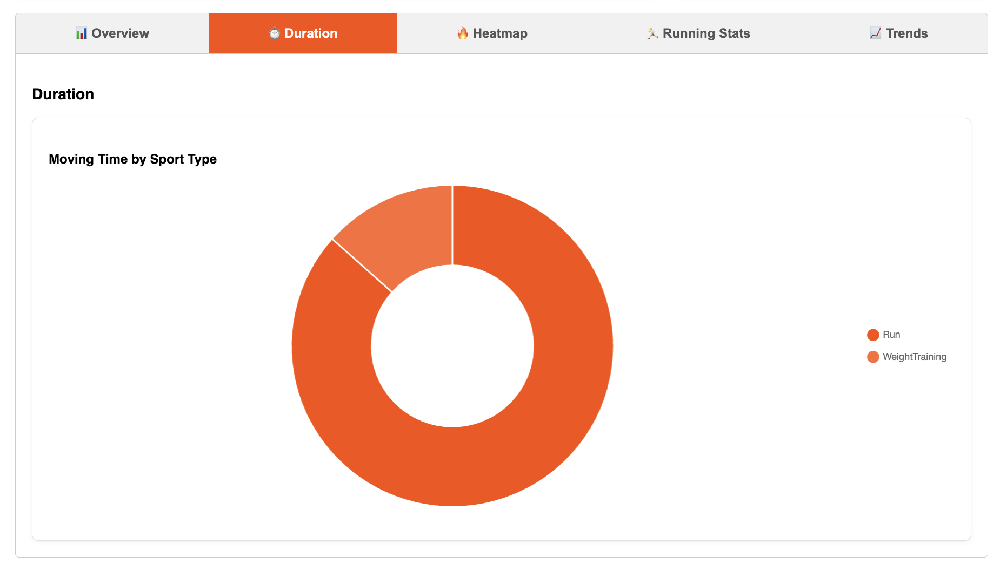
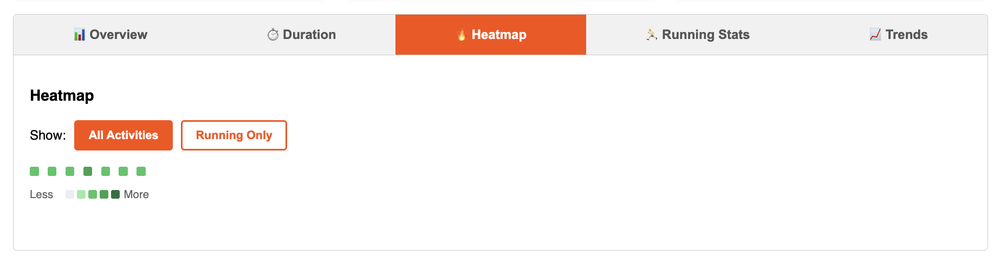
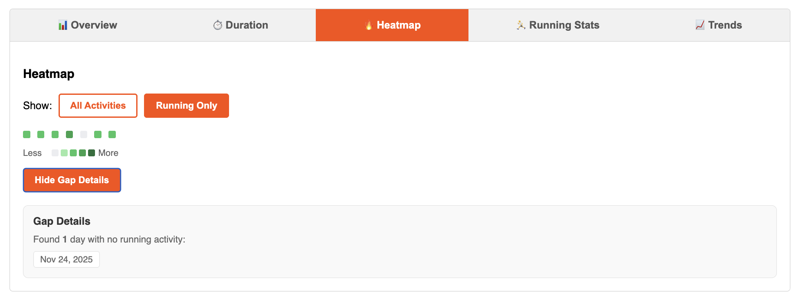
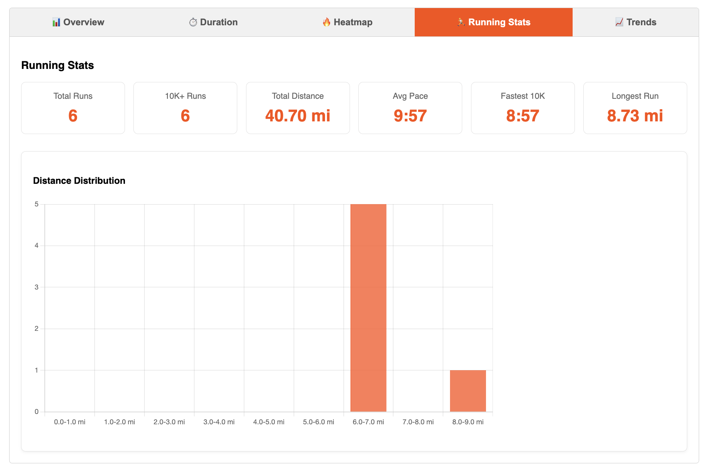
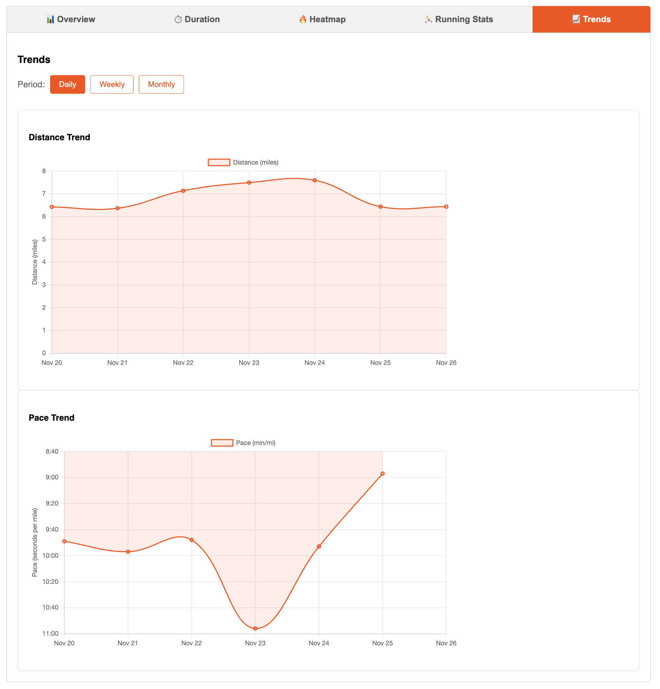

# Strava Activity Analyzer (Go)

A web application that authenticates users via Strava, fetches their activity history, and presents read-only interactive analytics.

## Getting Started

### Prerequisites
*   Go 1.25.4 or higher.

### Configuration

1. **Copy the example environment file:**
   ```bash
   cp .env.example .env
   ```

2. **Get your Strava API credentials:**
   *   Visit [Strava API Settings](https://www.strava.com/settings/api)
   *   Create a new application or use an existing one
   *   Copy your `Client ID` and `Client Secret`

3. **Generate a secure SESSION_SECRET:**
   
   The `SESSION_SECRET` is required for secure session management. Generate a secure random string using one of these methods:
   
   **Option 1: Using OpenSSL (recommended)**
   ```bash
   openssl rand -hex 32
   ```
   
   **Option 2: Using Python**
   ```bash
   python3 -c "import secrets; print(secrets.token_hex(32))"
   ```
   
   **Option 3: Using Node.js**
   ```bash
   node -e "console.log(require('crypto').randomBytes(32).toString('hex'))"
   ```
   
   Copy the generated value and add it to your `.env` file:
   ```bash
   SESSION_SECRET=your-generated-secret-here
   ```

4. **Update your `.env` file:**
   ```bash
   STRAVA_CLIENT_ID=your_client_id_here
   STRAVA_CLIENT_SECRET=your_client_secret_here
   SESSION_SECRET=your-generated-secret-here
   PORT=8080
   ```

### Quickstart

To start the application and automatically open it in your browser (at http://localhost:8080):

```bash
./quickstart.sh
```

## Screenshots

<div align="center">

[](docs/images/overview.png)
[](docs/images/duration.png)
[](docs/images/heatmap-all.png)

[](docs/images/heatmap-running.png)
[](docs/images/running-stats.png)
[](docs/images/trends.png)

</div>

## Features

### Authentication & Security
*   Secure OAuth2 authentication with Strava
*   CSRF protection and secure session management
*   Automatic token refresh to maintain active sessions
*   Server-side token storage (never exposed to client)

### Data Management
*   Activity fetching with full pagination support
*   Robust error handling (rate limits, unauthorized, server errors)
*   Timezone-independent date alignment
*   In-memory caching to reduce API calls
*   Concurrent data fetching for optimized performance

### Interactive Dashboard
*   **Summary Cards**: Date range, total activities, and moving time
*   **Activity List**: Detailed view of all activities with sport type, distance, and duration
*   **Date Range Picker**: Preset options (7d, 30d, 90d, 6m, YTD) and custom date selection
*   **Unit Toggle**: Switch between Metric and Imperial units (defaults to Imperial)
*   **URL Persistence**: Date range and preferences saved in URL for easy sharing

### Visualizations

#### Overview Tab
*   Activity counts distribution (pie/doughnut chart) by sport type

#### Duration Tab
*   Moving time distribution (pie/doughnut chart) by sport type

#### Heatmap Tab
*   Calendar-based activity heatmap showing training consistency
*   Intensity levels based on moving time
*   Toggle between "All Activities" and "Running Only" views
*   "Show Gap Details" to view days with no activities
*   Interactive tooltips with activity details

#### Running Stats Tab
*   Summary statistics: Total Runs, 10K+ Runs, Total Distance, Average Pace
*   Personal Records: Fastest 10K, Longest Run
*   Distance distribution histogram

#### Trends Tab
*   Distance trend line chart over time
*   Pace trend line chart over time
*   Period toggle: Daily, Weekly, Monthly
*   Moving averages for data smoothing

### User Experience
*   Loading spinners for all data operations
*   Comprehensive error handling with user-friendly messages
*   Empty states when no data is available
*   Dynamic tab visibility (tabs hide when no relevant data)
*   Responsive design optimized for mobile, tablet, and desktop
*   Touch-friendly interface elements

## Project Structure
*   `cmd/`: Application entry points.
*   `internal/`: Core business logic and API clients.
*   `web/`: HTML templates and static assets.
*   `docs/`: Requirements, specifications, and development tasks.

## License
See [LICENSE](LICENSE) file.
